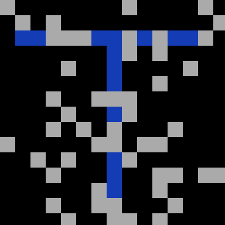
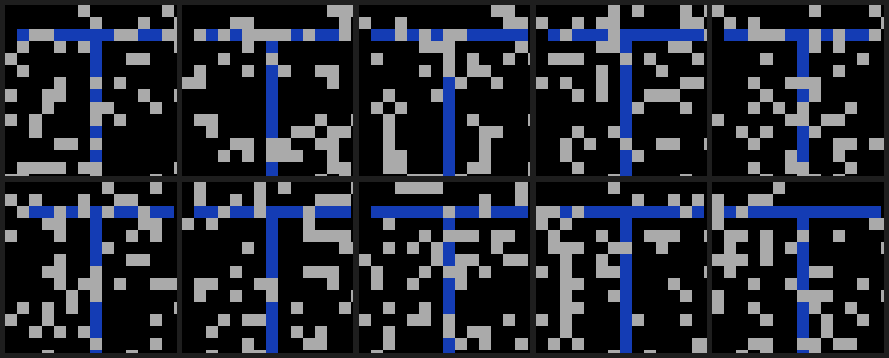
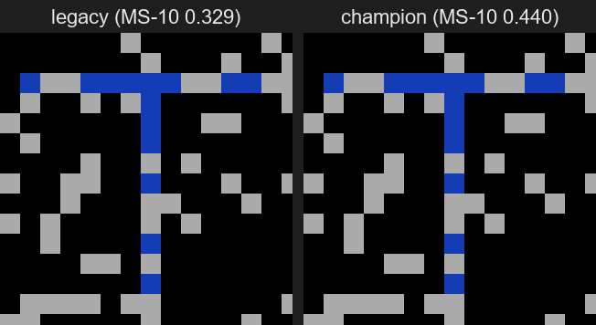
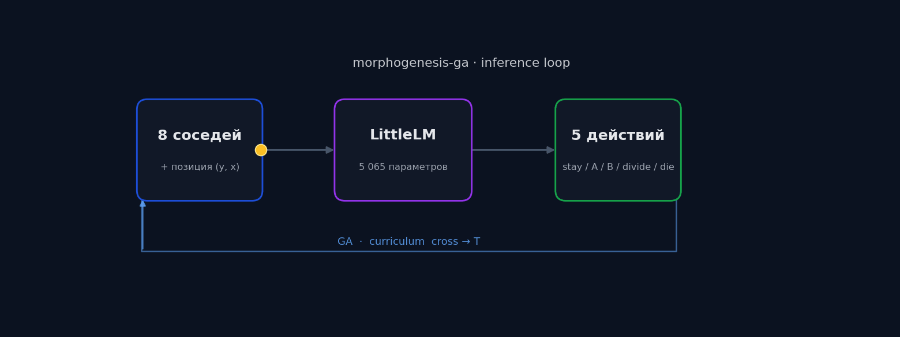

<div align="center">

# morphogenesis-ga

**Tiny neural cellular automata that grow target shapes, evolved by a genetic algorithm.**

A neuroevolution sandbox in the spirit of Mordvintsev's
[*Growing Neural Cellular Automata*](https://distill.pub/2020/growing-ca/),
built from scratch with a hard reproducibility budget and a paranoid
experiment governance loop.

[](https://www.python.org/)
[](LICENSE)
[](#tests)
[](#tests)
[](https://pytorch.org/)



*Champion model on seed 4 — 250 simulation steps, 5 065 parameters, MS-10 IoU = 0.440.*

</div>

---

## What this is

Each cell on a 15×15 grid runs a tiny transformer (`LittleLM`, 5 065
parameters). The cell sees its 8 Moore neighbours plus its own `(y, x)`
coordinate, and chooses one of five actions: stay, differentiate to
type A, differentiate to type B, divide, die.

Cells are not pre-programmed. The neural weights are evolved by a
**genetic algorithm** against a multi-objective fitness function (IoU
with a target shape, false positives, area regularisation, T-structure
bonuses). A four-phase curriculum first teaches the population to grow
a `+` cross, then transitions to the harder `T` shape.

The repository is a complete experimental record:
20+ documented experiments, [a live decision journal](docs/DECISION_2026-04-19.md),
a frozen reproducibility baseline, golden-anchor regression tests at
`1e-6` tolerance on CUDA, and a hooks-enforced
[Pre-Experiment Gate](.claude/skills/experiment-config/SKILL.md) that
refuses to start training without a written hypothesis and a
multi-seed success criterion.

---

## Visual demo

<table>
<tr>
<td align="center"><b>10 seeds in parallel</b><br>seed-consistency check<br></td>
<td align="center"><b>Before / after</b><br>legacy MS-10 0.329 vs champion 0.440<br></td>
</tr>
</table>

The colour code is the same as the on-screen pygame renderer:
**black** empty · **grey** stem · **green** correct cell inside target ·
**orange** cell outside target (false positive) · **dark blue** empty
inside target (false negative).

---

## Quickstart

```bash
git clone https://github.com/Nasferatuss/morphogenesis-ga.git
cd morphogenesis-ga
python -m venv .venv && source .venv/bin/activate   # Windows: .venv\Scripts\activate
pip install -e ".[viz,tb,dev,hpo]"

# 1. Smoke-test (no training, ~5 s) — sanity-check the install
python run_train.py --config configs/baseline_T.yaml --steps 0 --no-viz

# 2. Train the champion config (~25 min on a single CUDA GPU)
python run_train.py --config configs/exp_directional_presence_v1.yaml --train-ga --no-viz

# 3. Multi-seed benchmark — what counts as a real result, not training peak
python scripts/multiseed_bench.py runs/exp_directional_presence_v1_*/best_t.pt --baseline-iou 0.440

# 4. Visualise: ASCII grid + animated GIF
python scripts/dump_grid.py runs/exp_directional_presence_v1_*/best_t.pt --seeds 0,2,4,5,8
python scripts/render_champion_gif.py runs/exp_directional_presence_v1_*/best_t.pt --seed 4
```

---

## Architecture

<div align="center">

</div>

```
run_train.py                      Thin CLI (~112 lines)
src/                              Domain primitives
  world.py                        2D grid + 8 directional divide actions
  model.py                        LittleLM (5K params, transformer + spatial proj)
  ga.py                           GA engine: selection, crossover, mutation
  simulate.py                     Step-by-step simulation loop
  fitness.py                      Multi-objective fitness (15+ components)
  targets.py                      T, cross, custom bitmap masks
  viz.py                          Pygame renderer + GIF export
  benchmark.py                    Multi-seed evaluation framework
core/services/                    simulator · config_loader · factory · cleanup ·
                                  stats · writer · visualizer · hpo · benchmark_runner
core/memory/                      metrics_logger · mlflow_tracker (soft dep)
agents/train_agent/               train_ga pipeline · adaptive_mutation · t_weights
agents/eval_agent/                play_best replay
benchmarks/cross/, t_shape/       Formal benchmark specs
configs/                          YAML experiment configurations
docs/DECISION_2026-04-19.md       Live experiment decision journal
.claude/rules/                    experimental-findings.md · roadmap-status.md
.claude/skills/experiment-loop/   8-step Pre-Experiment Gate
tests/                            311 fast + 9 v1 anchors + 33 v2 anchors
scripts/multiseed_bench.py        Standalone benchmark CLI
```

---

## Benchmarks

The locked baseline is **MS-10 IoU = 0.440**, measured on
`runs/exp_directional_presence_v1_*/best_t.pt` across world seeds 0–9.

<div align="center">

</div>

| Milestone | MS-10 mean | Reach ≥ 0.30 | Reach ≥ 0.40 | Reach ≥ 0.50 | Δ vs prev |
|---|---|---|---|---|---|
| Manual tuning (58 runs, March 2026) | 0.256 | 4 / 10 | 0 / 10 | 0 / 10 | — |
| Positional encoding added | 0.339 | 10 / 10 | 0 / 10 | 0 / 10 | +32% |
| HPO winner (RNG-bug) | 0.4254 | — | — | — | unreproducible |
| Post-RNG-fix baseline (v2) | 0.329 | 10 / 10 | 0 / 10 | 0 / 10 | — |
| **Champion: directional + presence** | **0.440** | **10 / 10** | **9 / 10** | **0 / 10** | **+34%** |

The 0.50 ceiling has not been broken on this architecture. Seven
follow-up experiments (5 fitness axes + 1 combined + 1 curriculum
redesign) all failed to beat 0.440. The bottleneck is no longer
fitness weights — it is seed-generalisation under a 5 K parameter
budget. See [`docs/DECISION_2026-04-19.md`](docs/DECISION_2026-04-19.md)
§5 for the structural-vs-fitness analysis.

---

## How experiments are governed

This repository treats experimentation as a discipline, not a vibe.
Every training run with a fitness-delta hypothesis must pass the
Pre-Experiment Gate before launching:

1. Read the latest [`docs/DECISION_*.md`](docs/) — has this been tried?
2. Check `.claude/rules/experimental-findings.md` for relevant gotchas
3. Write the hypothesis in one sentence, with a mechanism (≤ 20 words)
4. Define the success criterion **before** training starts
5. Diff the proposed config against the locked baseline

After training: the result, the verdict, and one of `success / partial /
failure` get appended to the Decision Doc by the
[`experiment-loop`](.claude/skills/experiment-loop/SKILL.md) skill.
Failures move the corresponding axis to `§3 Dead Ends` so it is never
retested by accident.

There is also a Stop-hook that fires at the end of every Claude Code
turn ([`scripts/hooks/decision-doc-reminder.sh`](scripts/hooks/decision-doc-reminder.sh))
and yells if you touched `configs/exp_*` or `runs/` without updating
the journal.

---

## Reproducibility

Same seed produces a bit-identical fitness trajectory:
- `TestGoldenBaselineV1` — 9 anchors @ tolerance `1e-9` (CPU)
- `TestGoldenBaselineV2` — 33 anchors @ tolerance `1e-6` (CUDA)

```bash
pytest tests/test_golden.py -v
```

The frozen configs are `configs/reproducibility_freeze_v1.yaml` and
`configs/reproducibility_freeze_v2.yaml`. The HPO winner from
2026-04-11 reported MS-10 = 0.4254, was found unreproducible
([RNG bug postmortem](docs/research/hpo_v2_report.md)), fixed in
commit `1a10ac9`, and locked at 0.329 — all logged and tested.

---

## Tests

```bash
pytest tests/ --cov=src --cov=core --cov=agents --cov-report=term-missing
```

353 tests total (311 fast + 9 v1 anchors + 33 v2 anchors). Coverage
is 79% overall, 89% if you exclude `agents/train_agent/pipeline.py`
(which is mid-decomposition — Round 4 of closure extraction is
deferred as a dedicated session).

---

## Article

A long-form write-up of the project is on Habr:
[*Месяц с Neural Cellular Automata — 22 эксперимента, потолок 0.44 и
дисциплина которой я не ожидал*](#) *(link will be added after
publication)*. The article is the recommended entry point for anyone
who wants the narrative; this README is the technical map.

The article was written in collaboration with **Claude Code** (first
hands-on experience working with an AI coding agent on a multi-week
research project). The Decision Doc, the experiment-loop skill, the
findings rule and the Stop-hook are all artefacts of that workflow,
not retrofitted afterwards.

---

## References

- Alexander Mordvintsev *et al.* — *Growing Neural Cellular Automata*,
  Distill (2020). https://distill.pub/2020/growing-ca/ — the canonical
  starting point for Neural CA.
- Bert Wang-Chak Chan — *Lenia: Biology of Artificial Life* (2018+).
  Continuous-state CA with rich emergent behaviour.
- Sebastian Risi & Kenneth Stanley — *Deep Neuroevolution*. Survey
  framing for evolutionary training of neural networks.
- Anthropic — *Claude Code* documentation. The agent and skills
  framework used for this project.

---

## License

MIT — see [LICENSE](LICENSE).
